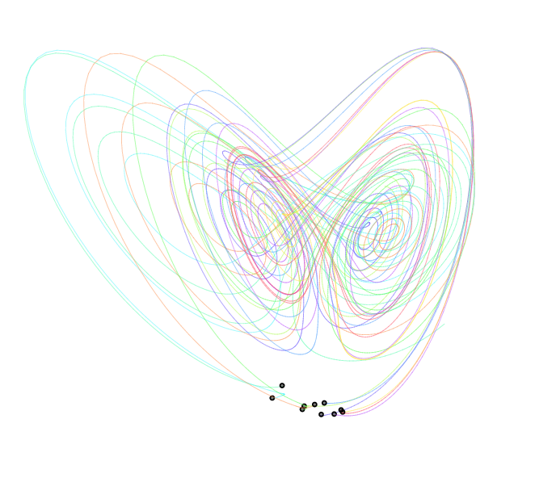
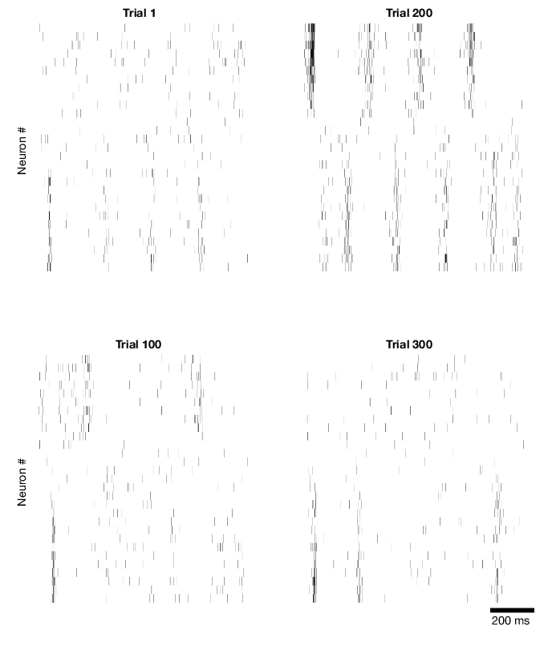

# Setting up LFADS runs

Assuming you have finished [adapting the LFADS run manager classes to your dataset](interfacing), you should be all set to generate some LFADS runs and start training. We'll be setting up a _drive script_ that will do the work of creating the appropriate instances, pointing at the datasets, creating the runs, and telling `lfads-run-manager` to generate the files needed for LFADS. Below, we'll refer to the package name as `MyExperiment`, but you should substitute this with your package name.

!!! tip "Follow along with `MyExperiment.drive_script`"
    A complete drive script is available as a starting point in `+MyExperiment/drive_script.m` for you to copy/paste from.


## Lorenz attractor example
For this demo, we'll generate a few datasets of synthetic spiking data generated by a Lorenz attractor using the following code:

```matlab
datasetPath = '~/lorenz_example/datasets';
LFADS.Utils.generateDemoDatasets(datasetPath);
```

This will simulate a chaotic 3 dimensional [Lorenz attractor](https://en.wikipedia.org/wiki/Lorenz_system) as the underlying dynamical system, initialized from 65 initial conditions. Here is a subset of 10 conditions' trajectories:



From these 3 dimensions, we generate random matrices along which to project these 3 dimensions to produce the firing rates of individual units (plus a constant bias term). The initial conditions (defining the _conditions_) and subsequent dynamical trajectories are the same across datasets. Each dataset will contain a variable number of neurons (between 25--35). The rates of these neurons are then constructed by projecting the 3-d Lorenz trajectory through a dataset-specific readout matrix, adding the bias, and exponentiating. We then draw spikes from the inhomogenous Poisson process for 20-30 trials for each condition.

Here are a few examples of single trial spike rasters. The units have been sorted according to their loading onto the first dimension of the attractor:



## Building a dataset collection and adding datasets

First, create a dataset collection that points to a folder on disk where datasets are stored:

```matlab
dataPath = '~/lorenz_example/datasets';
dc = MyExperiment.DatasetCollection(dataPath);
dc.name = 'lorenz_example';
```

Then, we can add the individual datasets within based on their individual paths. Note that when a new dataset instance is created, it is automatically added to the `DatasetCollection` and will replace any dataset that has the same name if present.

```matlab
MyExperiment.Dataset(dc, 'dataset001.mat');
MyExperiment.Dataset(dc, 'dataset002.mat');
MyExperiment.Dataset(dc, 'dataset003.mat');
```

!!! tip "Auto-detecting datasets"
    You might consider adding a method to your `DatasetCollection` class which can automatically detect all of the datasets in a specific folder. An example, which would add every `.mat` file detected in the folder might look like this:

    ```matlab
    function autoDetectDatasets(dc)
        dc.clearDatasets(); % in case there are existing datasets already added

        % automatically find all .mat files within dc.path and build datasets for each
        files = dir(dc.path);
        for iF = 1:numel(files)
            if strncmp(files(iF).name, '.', 1), continue, end
            info = files(iF);
            [~, ~, ext] = fileparts(info.name);
            if ~strcmp(ext, '.mat'), continue; end
            ds = MyExperiment.Dataset(dc, info.name); % change this to match your package name
        end
    end
    ```

You can verify that the datasets have been added to the collection:

```matlab
>> dc
MyExperiment.DatasetCollection "lorenz_example"
  3 datasets in ~/lorenz_example/datasets
  [ 1] MyExperiment.Dataset "dataset001"
  [ 2] MyExperiment.Dataset "dataset002"
  [ 3] MyExperiment.Dataset "dataset003"

         name: 'lorenz_example'
      comment: ''
         path: '~/lorenz_example/datasetss'
     datasets: [3x1 MyExperiment.Dataset]
    nDatasets: 3
```

You can access individual datasets using `:::matlab dc.datasets(1)` or by name with `:::matlab dc.matchDatasetsByName('dataset001')`.

You can then load all of the metadata for the datasets using:
```matlab
dc.loadInfo();
```

and view a summary of the results using:

```matlab
>> dc.getDatasetInfoTable          

                  subject                  date             saveTags    nTrials    nChannels
              ________________    ______________________    ________    _______    _________

dataset001    'lorenz_example'    [01-Oct-2017 00:00:00]    '1'         1200       24
dataset002    'lorenz_example'    [02-Oct-2017 00:00:00]    '1'         1350       26
dataset003    'lorenz_example'    [03-Oct-2017 00:00:00]    '1'         1000       21

```

## Create a `RunCollection`

We'll now setup a `RunCollection` that will contain all of the LFADS runs we'll be training. Inside this folder will be stored all of the processed data and LFADS output, nicely organized within subfolders.

```matlab
runRoot = '~/lorenz_example/runs';
rc = MyExperiment.RunCollection(runRoot, 'exampleRun', dc);
```

## Add the `RunSpec` instances

Recall that `RunSpec` instances specify which datasets are included in a specific run. We'll start by setting up a single dataset run for each of the datasets:

```matlab
for iR = 1:dc.nDatasets
    runSpec = MyExperiment.RunSpec(dc.datasets(iR).getSingleRunName(), dc, iR);
    rc.addRunSpec(runSpec);
end
```

You can adjust the arguments to the constructor of `MyExperiment.RunSpec`, but in the example provided the inputs define:

* the unique name of the run. Here we use `getSingleRunName`, a convenience method of `Dataset` that generates a name like `single_datasetName`.
* the `DatasetCollection`
* the indices or names of datasets (as a string or cell array of strings) to include

We will also add a multi-session stitching run which includes all datasets:

```matlab
rc.addRunSpec(MyExperiment.RunSpec('all', dc, 1:dc.nDatasets));
```

## Specify the hyperparameters

We'll next specify a single set of hyperparameters to begin with. Since this is a simple dataset, we'll reduce the size of the generator network to 64 and reduce the number of factors to 8.

```matlab
par = MyExperiment.RunParams;
par.spikeBinMs = 2; % rebin the data at 2 ms
par.c_co_dim = 0; % no controller --> no inputs to generator
par.c_batch_size = 150; % must be < 1/5 of the min trial count

par.c_factors_dim = 8; % number of factors read out from generator to generate rates
par.useAlignmentMatrix = true; % use alignment matrices initial guess for multisession stitching

par.c_gen_dim = 64; % number of units in generator RNN
par.c_ic_enc_dim = 64; % number of units in encoder RNN

par.c_learning_rate_stop = 1e-3; % we can stop really early for the demo
```

As we wish stitch multiple datasets together in one of the runs, we'll also specify that we'd like to automatically specify an initial guess for the alignment matrices that link neurons to factors for each dataset using `useAlignmentMatrix`.

!!! warning "Setting batch size"
    The number of trials in your smallest dataset determines the largest batch size you can pick. If `trainToTestRatio` is 4 (the default), then you will need at least 4+1 = 5 times as many trials in every dataset as `c_batch_size`. If you choose a batch size which is too large, `lfads-run-manager` will generate an error to alert you.

We then add this `RunParams` to the run collection:
```matlab
rc.addParams(par);
```

You can then look at the parameter settings added to `rc` using `rc.params`:

```matlab
>> rc.params

MyExperiment.RunParams param_Qr2PeG data_-MSPr6
useAlignmentMatrix=true c_factors_dim=8 c_ic_enc_dim=64 c_gen_dim=64 c_co_dim=0 c_batch_size=150 c_learning_rate_stop=0.001

...
```

### `RunParams` data and param hashes
The six digit alphanumeric hash values are used to uniquely and concisely identify the runs so that they can be conveniently located on disk in a predictable fashion. There are two hash values for each `RunParams` instance. The first is the hash of the whole collection of parameter settings which differ from their defaults, which is prefixed with `param_`.  

The second is a hash of only those parameter settings that affect the input data used by LFADS, prefixed by `data_`. We use two separate hashes here to save space on disk; many parameters like `c_co_dim` only affect LFADS internally, but the input data is the same. Consequently, generating a large sweep of parameters like `c_co_dim` would otherwise require many copies of identical data to be saved on disk. Intead, we store the data in folders according to the `data_` hash and symlink copies for each run.

Below the hash values are the set of properties whose values differ from their specified defaults (as specified next to the property in the class definition). Properties which are equal to their default values are not included in the hash calculation. This allows you to add new properties to your `RunParams` class without altering the computed hashes for older runs. See this [warning note](interfacing/#editing-runparamsm-optional) for more details.

!!! tip "Specifying data-hash affecting parameters"
    By default, the `data_` hash includes all properties that do not begin with `c_` as these are passed directly to the Python+Tensorflow LFADS code. This includes all of the parameters that you have added to `RunParams`. If you need to adjust this behavior, override the method `getListPropertiesNotAffectingInputData` in your `RunParams` instance.

!!! tip "`RunParams` is a value class"
    Unlike all of the other classes, `RunParams` is not a handle but a value class, which acts similarly to a `struct` in that it is passed by value. This means that after adding the `RunParams` instance `par` to the `RunCollection`, we can modify `par` and then add it again to define a second set of parameters, like this:
    ```matlab
    par.c_gen_dim = 96;
    rc.addParams(par);
    par.c_gen_dim = 128;
    rc.addParams(par);
    ```

!!! tip "Generating hyperparameter value sweeps"
    If you wish to sweep a specific property or set of properties, you can create a `RunParams` instance, set the other properties as needed, and then call `generateSweep` to build an array of `RunParams` instances:
    ```matlab
    parSet = par.generateSweep('c_gen_dim', [32 64 96 128]);
    rc.addParams(parSet);
    ```

    Or along multiple parameters in a grid:
    ```matlab
    parSet = par.generateSweep('c_gen_dim', [32 64 96 128], 'c_co_dim', 0:2:4);
    rc.addParams(parSet);
    ```

## Check the `RunCollection`

The `RunCollection` will now display inforation about the parameter settings and run specifications that have been added:

```matlab
>> rc

MyExperiment.RunCollection "exampleRun" (5 runs total)
  Dataset Collection "lorenz_example" (4 datasets) in ~/lorenz_example/datasets
  Path: ~/lorenz_example/runs/exampleRun

  1 parameter settings
  [1 param_Qr2PeG data_-MSPr6] MyExperiment.RunParams useAlignmentMatrix=true c_factors_dim=8 c_ic_enc_dim=64 c_gen_dim=64 c_co_dim=0 c_batch_size=150 c_learning_rate_stop=0.001

  5 run specifications
  [ 1] MyExperiment.RunSpec "single_dataset001" (1 datasets)
  [ 2] MyExperiment.RunSpec "single_dataset002" (1 datasets)
  [ 3] MyExperiment.RunSpec "single_dataset003" (1 datasets)
  [ 4] MyExperiment.RunSpec "single_dataset004" (1 datasets)
  [ 5] MyExperiment.RunSpec "all" (4 datasets)

                          name: 'exampleRun'
                       comment: ''
                      rootPath: '~/lorenz_example/runs'
                       version: 3
             datasetCollection: [1x1 MyExperiment.DatasetCollection]
                          runs: [5x1 MyExperiment.Run]
                        params: [1x1 MyExperiment.RunParams]
                      runSpecs: [5x1 MyExperiment.RunSpec]
                       nParams: 1
                     nRunSpecs: 5
                    nRunsTotal: 5
                     nDatasets: 4
                          path: '~/lorenz_example/runs/exampleRun'
      pathsCommonDataForParams: {'~/lorenz_example/runs/exampleRun/data_-MSPr6'}
                pathsForParams: {'~/lorenz_example/runs/exampleRun/param_Qr2PeG'}
    fileShellScriptTensorboard: '~/lorenz_example/runs/exampleRun/launch_tensorboard.sh'
               fileSummaryText: '~/lorenz_example/runs/exampleRun/summary.txt'
       fileShellScriptRunQueue: '~/lorenz_example/runs/exampleRun/run_lfadsqueue.py'
```

## Prepare for LFADS

Now that you've set up your run collection with all of your runs, you can run the following to generate the files needed for running LFADS.

```matlab
rc.prepareForLFADS();
```

This will generate files for all runs. If you decide to add new runs, by adding additional run specifications or parameters, you can simply call `prepareForLFADS` again. Existing files won't be overwritten unless you call `rc.prepareForLFADS(true)`.

Also, a `summary.txt` file will be generated which can be useful for identifying all of the runs and their locations on disk. You can also generate this text from within Matlab by calling `rc.generateSummaryText()`.

```
MyExperiment.RunCollection "exampleRun" (4 runs total)
  Path: ~/lorenz_example/runs/exampleRun
  Dataset Collection "lorenz_example" (3 datasets) in ~/lorenz_example/datasets

  ------------------------

  4 Run Specifications:

    [runSpec 1] MyExperiment.RunSpec "single_dataset001" (1 datasets)
      [ds 1] MyExperiment.Dataset "dataset001"

    [runSpec 2] MyExperiment.RunSpec "single_dataset002" (1 datasets)
      [ds 2] MyExperiment.Dataset "dataset002"

    [runSpec 3] MyExperiment.RunSpec "single_dataset003" (1 datasets)
      [ds 3] MyExperiment.Dataset "dataset003"

    [runSpec 4] MyExperiment.RunSpec "all" (3 datasets)
      [ds 1] MyExperiment.Dataset "dataset001"
      [ds 2] MyExperiment.Dataset "dataset002"
      [ds 3] MyExperiment.Dataset "dataset003"

  ------------------------

  1 Parameter Settings:

    [1 param_Qr2PeG] MyExperiment.RunParams
      Diff: useAlignmentMatrix=true c_factors_dim=8 c_ic_enc_dim=64 c_gen_dim=64 c_co_dim=0 c_batch_size=150 c_learning_rate_stop=0.001

      spikeBinMs: 2
      trainToTestRatio: 4
      useAlignmentMatrix: true
      scaleIncreaseStepsWithDatasets: true
      c_cell_clip_value: 5
      c_factors_dim: 8
      c_ic_enc_dim: 64
      c_ci_enc_dim: 128
      c_gen_dim: 64
      c_keep_prob: 0.95
      c_learning_rate_decay_factor: 0.98
      c_device: /gpu:0
      c_co_dim: 0
      c_do_causal_controller: false
      c_do_feed_factors_to_controller: true
      c_feedback_factors_or_rates: factors
      c_controller_input_lag: 1
      c_l2_gen_scale: 500
      c_l2_con_scale: 500
      c_batch_size: 150
      c_kl_increase_steps: 900
      c_l2_increase_steps: 900
      c_ic_dim: 64
      c_con_dim: 128
      c_learning_rate_stop: 0.001
      c_temporal_spike_jitter_width: 0
      c_allow_gpu_growth: true
      c_kl_ic_weight: 1
      c_kl_co_weight: 1
      c_inject_ext_input_to_gen: false

```
